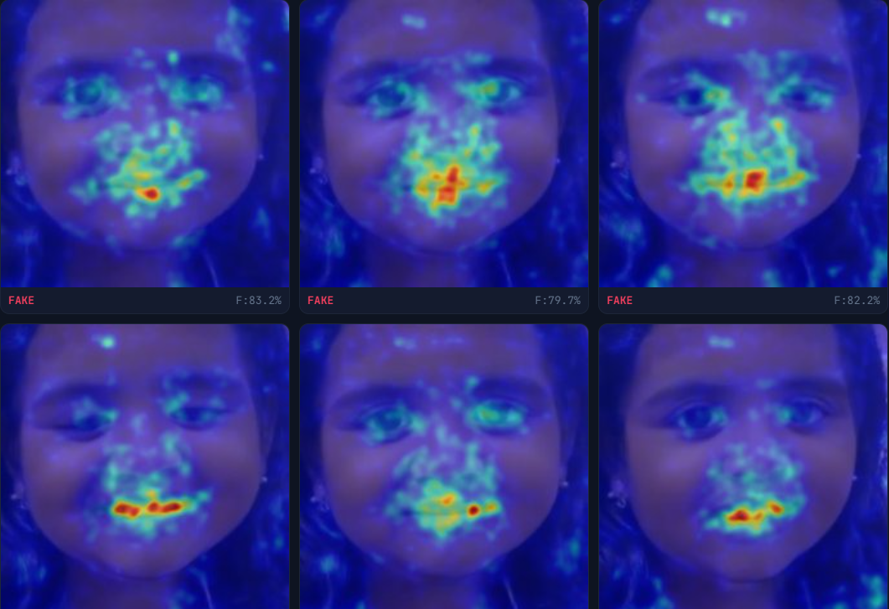
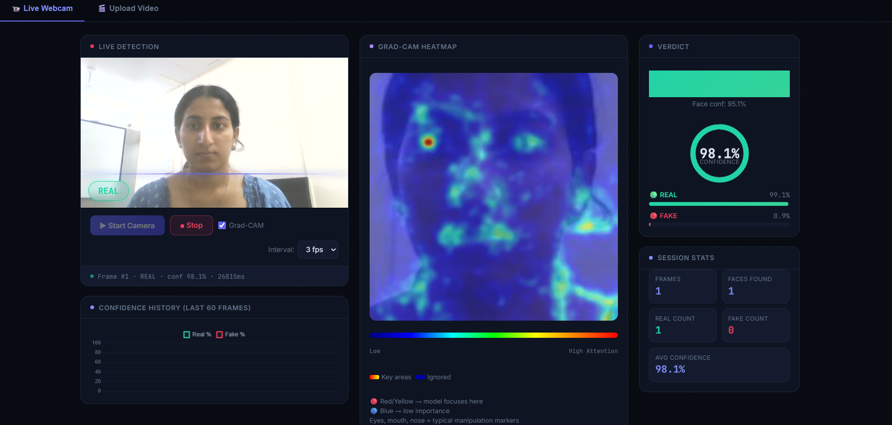
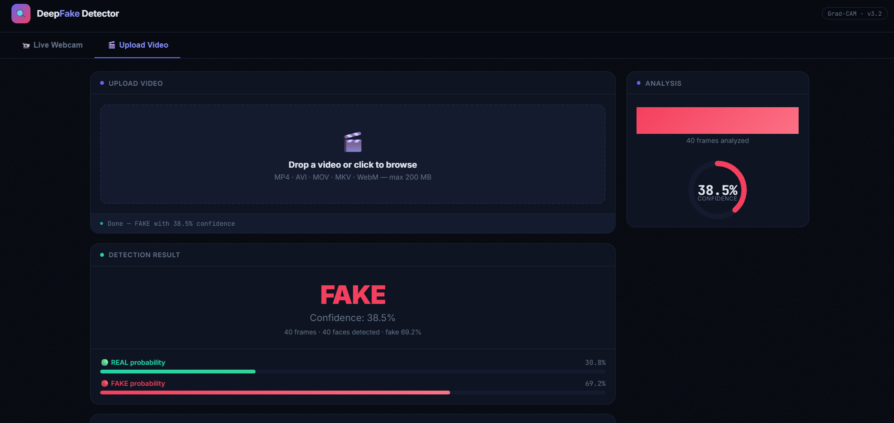

# 🔍 FakeXpose — Multimodal Deepfake Detection System

FakeXpose is an **end-to-end multimodal deepfake detection platform** that analyzes **both video and audio** to identify AI-generated manipulation.

The system combines **EfficientNet-based video analysis**, **ensemble audio classification**, and **Grad-CAM explainability** to expose manipulated media in real time.

---

# 📸 Demo Screenshots

## 🔥 Grad-CAM Deepfake Attention

The model highlights manipulated facial regions such as the **mouth, nose, and eyes**, where deepfake artifacts commonly appear.



---

## 🖥️ Live Webcam Detection

Real-time deepfake detection using webcam frames with explainable Grad-CAM visualization.



---

## 📹 Video Upload Analysis

Upload a video and get a **frame-level deepfake verdict** with weighted aggregation.



---

# 📌 Overview

FakeXpose provides a **complete deepfake detection pipeline** with:

* 📹 **Video deepfake detection**
* 🎙️ **Audio deepfake detection**
* 📷 **Real-time webcam analysis**
* 🔥 **Grad-CAM explainability**
* 📡 **QR code sharing via ngrok**
* 🌐 **Interactive web interface**

---

# ✨ Features

| Feature             | Description                                     |
| ------------------- | ----------------------------------------------- |
| 🎥 Video Upload     | Analyze `.mp4`, `.avi`, `.mov`, `.mkv`, `.webm` |
| 🎙️ Audio Detection | Ensemble ML on 170-dim acoustic features        |
| 📷 Live Webcam      | Real-time frame inference                       |
| 🔥 Grad-CAM         | Heatmaps highlighting manipulated regions       |
| 📊 Frame Stats      | Frame-level fake probability analysis           |
| 🩺 Diagnostics      | Debug endpoints for model verification          |
| 🌐 Web UI           | Browser interface served via FastAPI            |
| 📱 QR Code          | Share local server via ngrok                    |

---

# 🏗️ Architecture

## 🎬 Video Detection Pipeline

```
Input Video
    │
Frame Sampling (40 evenly spaced frames)
    │
Face Detection (MediaPipe BlazeFace)
    │
Face Crop + Preprocessing
    │
EfficientNetB0 Backbone
    │
Binary Classification (Sigmoid → P(real))
    │
Weighted Frame Aggregation
    │
Final Verdict: REAL / FAKE
```

### Model Details

| Parameter  | Value                   |
| ---------- | ----------------------- |
| Backbone   | EfficientNetB0          |
| Dataset    | DeepFakeDetection (DFD) |
| Input Size | 224 × 224               |
| Loss       | Focal Loss              |
| Accuracy   | 95%                     |

---

## 🎙️ Audio Detection Pipeline

```
Input Audio (.wav)
      │
Feature Extraction (170-dim vector)
      │
StandardScaler Normalization
      │
Ensemble ML Classifier
      │
Final Verdict
```

### Feature Groups

| Feature            | Dimensions |
| ------------------ | ---------- |
| MFCC               | 80         |
| Delta MFCC         | 40         |
| Chroma             | 24         |
| Spectral Features  | 6          |
| Zero Crossing Rate | 2          |
| RMS Energy         | 2          |
| Mel Spectrogram    | 4          |
| Tonnetz            | 12         |

### Model Performance

| Model         | Accuracy | AUC    |
| ------------- | -------- | ------ |
| Random Forest | 97.5%    | 0.9968 |
| XGBoost       | 97.5%    | 0.9967 |

---

# 🧠 Grad-CAM Explainability

FakeXpose includes **visual explanations** showing what parts of the face influenced the model.

Color meaning:

| Color        | Meaning        |
| ------------ | -------------- |
| Red / Yellow | High attention |
| Blue         | Low importance |

Typical artifact regions:

* Eyes
* Mouth
* Nose bridge

---

# 🛠️ Tech Stack

| Component        | Technology              |
| ---------------- | ----------------------- |
| Backend          | FastAPI + Uvicorn       |
| ML Framework     | TensorFlow / Keras      |
| Video Model      | EfficientNetB0          |
| Audio Model      | Random Forest / XGBoost |
| Face Detection   | MediaPipe BlazeFace     |
| Audio Features   | Librosa                 |
| Video Processing | OpenCV                  |
| Frontend         | HTML / CSS / JavaScript |
| Deployment       | ngrok                   |
| Training         | Google Colab            |

---

# 📁 Project Structure

```
DeepReal/
│
├── docs/
│   └── images/
│       ├── gradcam_heatmap.png
│       ├── live_webcam.png
│       └── video_upload_result.png
│
├── model/
│   ├── best_deepfake_model.h5
│   ├── deepfake_detector_model.pkl
│   ├── deepfake_detector_scaler.pkl
│
├── static/
│   └── index.html
│
├── main.py
├── qr.py
├── requirements.txt
└── README.md
```

---

# 🚀 Getting Started

## 1️⃣ Clone Repository

```
git clone https://github.com/your-username/DeepReal.git
cd DeepReal
```

---

## 2️⃣ Install Dependencies

```
pip install -r requirements.txt
```

Key libraries:

* TensorFlow
* FastAPI
* MediaPipe
* OpenCV
* Librosa
* XGBoost
* Scikit-learn

---

## 3️⃣ Add Models

Place trained models inside:

```
model/
```

Files required:

```
best_deepfake_model.h5
deepfake_detector_model.pkl
deepfake_detector_scaler.pkl
```

---

## 4️⃣ Run the Server

```
uvicorn main:app --host 0.0.0.0 --port 8000
```

Open:

```
http://localhost:8000
```

---

## 5️⃣ Share via ngrok (optional)

```
ngrok http 8000
```

Then generate QR:

```
python qr.py
```

---

# 🔌 API Endpoints

## POST `/detect`

Analyze uploaded video.

Response:

```
{
  "verdict": "FAKE",
  "confidence": 0.87,
  "fake_probability": 0.94,
  "real_probability": 0.06
}
```

---

## POST `/detect-frame`

Send base64 webcam frame.

```
{ "image": "data:image/jpeg;base64,..." }
```

---

## POST `/detect-audio`

Upload `.wav` audio file.

---

## GET `/health`

Returns model health status.

---

# 📊 Results

### Video Model

| Metric   | Value             |
| -------- | ----------------- |
| Accuracy | 95%               |
| Dataset  | DeepFakeDetection |

---

### Audio Model

| Metric   | Value |
| -------- | ----- |
| Accuracy | 97.5% |
| AUC      | 0.997 |

---

# 🤝 Contributing

Pull requests are welcome.
For major changes, open an issue first to discuss improvements.

---

# ⭐ Support

If you find this project useful, consider **starring the repository**.
